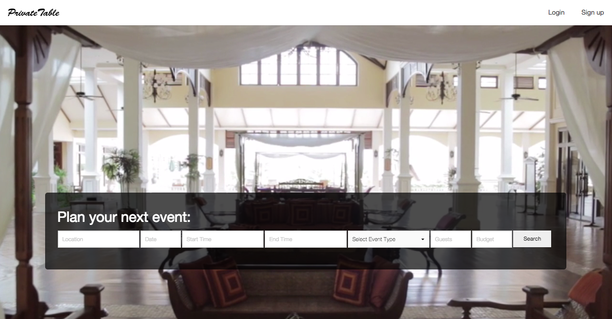
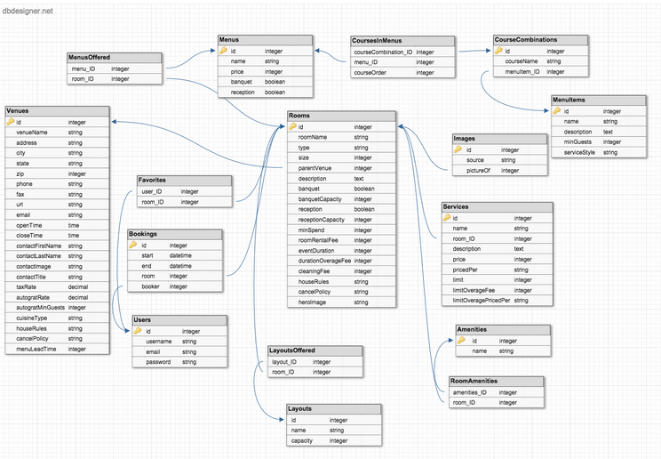
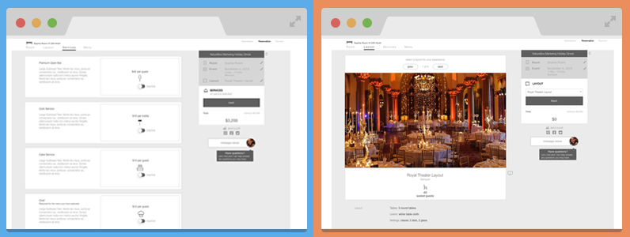

# PrivateTable

> The AirBnB for Event Spaces

Visit our live site at [PrivateTable.io](http://www.privatetable.io/). Search "San Francisco" for the full effect or check out the [video demo.](https://youtu.be/6z-8uyu8i40)

This project is built on [Angular](https://angularjs.org/), [Node](https://angularjs.org/), and [Express](http://expressjs.com/), with a [PostgreSQL](http://http://www.postgresql.org/) database and [Sequelize](http://docs.sequelizejs.com/en/latest/) for the ORM. 

Baseline scaffolding was generated with [Yeoman](https://github.com/yeoman/generator-angular)
version 0.11.1.

## Build & Development

###Build
- Download and unzip the repository.
- Install [Node](https://angularjs.org/) and [Bower](http://http://bower.io/).
- Run `npm install` from your CLI to install both npm and Bower dependencies.
- Rename `/server/config/dbConfig.example.js` to be `dbConfig.js`.
- Edit `dbConfig.js` to point to a valid relational database supported by Sequelize, and update `dbConfig.js` to match your database's security parameters. This product was originally designed using PostgreSQL and deployed on Heroku.
- Configure your database, per the [schema](#database-schema).
- Data within our database is not available so you will need to load your own data in your database.
- The app uses token-based authentication so you will need to create a secret key (any text file is fine) in `/server/config`, name it `secret` and replace the content with a new secret string.

###Run
- Run `node server/app.js` to preview locally.
- Also compatible with [Nodemon](https://github.com/remy/nodemon), as `nodemon server/app.js`.

### Database Schema

## Product Roadmap

Our team plans to expands to extend PrivateTable with additional features that support selectable event layouts, premium services, and customizable menus.

We will also expand the platform's CRM capabilities so that vendors can manage their properties and client relationships directly from PrivateTable.

## Team

  - __Product Owner__: Craig Smith
  - __Scrum Master__: Lindsay Pond
  - __Development Team Members__: Henry Ng

